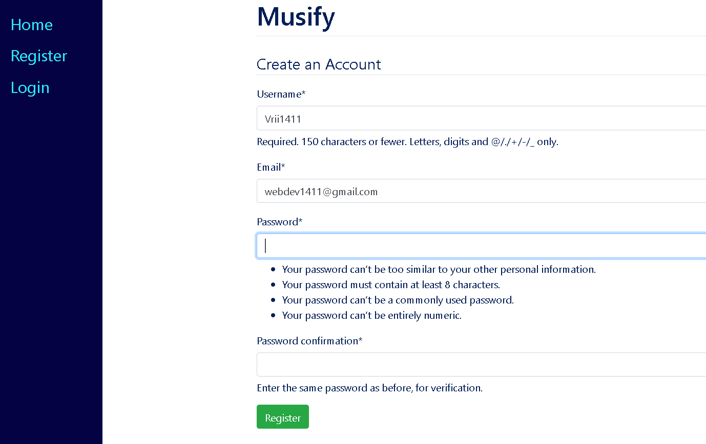
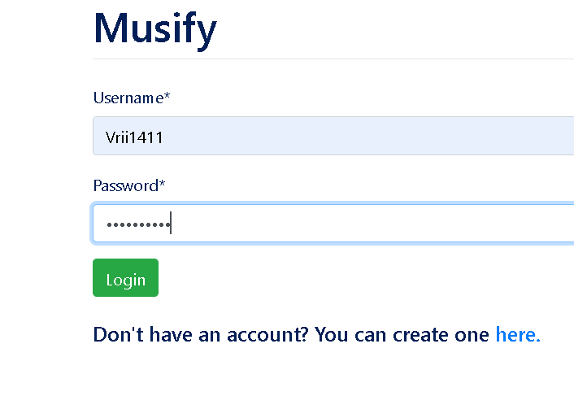
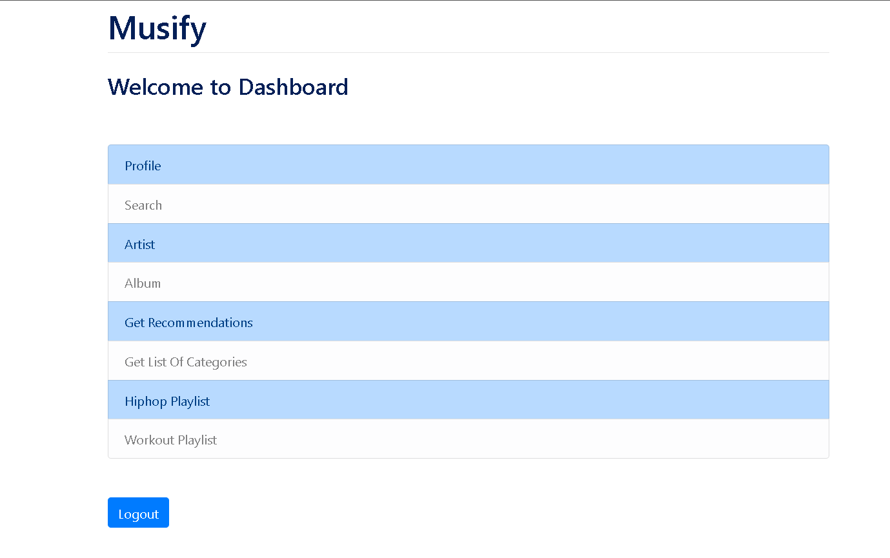
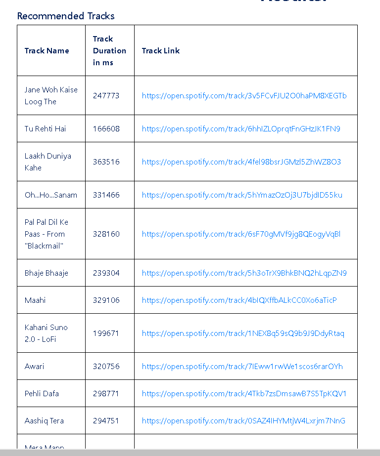

# Musify

A Basic Web Application using Django which uses Spotify API and its various endpoints to retrieve informtion for the user logged in.

## Steps to run the project:

1. Clone the project to your device and move to its directory
2. Create a virtual environment for the project
3. Install the packages using requirements.txt with this command: 
		pip install -r requirements.txt
4. Run migrations with - python manage.py migrate
5. Run the project using command "python manage.py runserver"

## Some features of the application:

Registration                  |                   Login
:---------------------------------:        |      :------------------------------:
  | 

Dashboard                   
     

Search Query            |                   Search Query Result
:---------------------------------:        |      :------------------------------:
     |

Artist Details Query                |                   Artist Details Result
:---------------------------------:        |      :------------------------------:
     |

Recommendations Query               |             Recommendations Result 
:---------------------------------:        |      :------------------------------:
     |

Workout Track                |                   Hiphop Track
:---------------------------------:        |      :------------------------------:
     |
